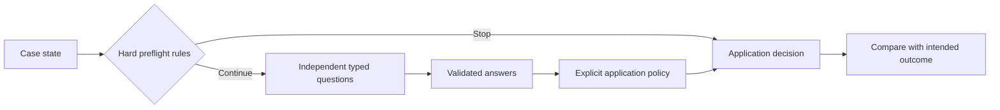

# Jev by Example

### The interesting decisions happen between agent steps.

Should a new memory replace an old one? Did a successful tool call actually finish the task? Is a retry about to create the same invoice twice?

**Ten runnable experiments in building agents that know what to do next—and when to ask.** Each combines a small Jev judgment with application logic you can read, change, and test.

By [Really Artificial](https://github.com/ReallyArtificial) · JavaScript · Node.js 20.17+ · Zero dependencies · [MIT](LICENSE)

**Initial release:** 10 examples, 34 authored cases. The HTTP implementation has been checked against the [official API reference](https://docs.typesafe.ai/api). Live model behavior has **not** yet been verified. The default demo uses clearly labeled, hand-authored responses.

## Start in thirty seconds

Clone the repository and run it:

```sh
git clone https://github.com/ReallyArtificial/jev-by-example.git
cd jev-by-example
npm start -- list
npm start -- run 02
npm run demo
```

No installation, account, API key, or network connection is needed for fixture mode.

Example excerpt from the **authored fixture demo**:

```text
02-memory-reconciliation / temporary-exception
  keep-scoped — Keep the original evidence and scope with any proposed memory change.
  Intended: keep-scoped · match · baseline: propose-replacement
```

The input says “For this weekend prototype only, use Python.” The policy keeps a scoped exception instead of replacing the standing TypeScript preference. Open [the example](examples/02-memory-reconciliation/) to inspect the question, inputs, and policy.

## Pick a problem

| # | Experiment | The interesting edge | What you learn |
| :-- | :-- | :-- | :-- |
| 01 | [The helpful agent that went too far](examples/01-permission-drift/) | An allowed tool used for an unrelated purpose | Separate permission from intent |
| 02 | [When a new memory should not erase an old one](examples/02-memory-reconciliation/) | A temporary exception mistaken for a permanent preference | Reconcile scope before updating memory |
| 03 | [The release note that outran the evidence](examples/03-evidence-gaps/) | One passing suite becomes a universal reliability claim | Check individual claims against artifacts |
| 04 | [Almost the same question. Dangerously different answer.](examples/04-semantic-cache-boundary/) | A near-identical query changes tenant or time period | Gate cache reuse beyond similarity |
| 05 | [HTTP 200 is not task completion](examples/05-tool-result-contract/) | A queued report masquerades as a completed deliverable | Check semantic postconditions |
| 06 | [The retry that creates a second invoice](examples/06-retry-or-reconcile/) | A timed-out write may already have succeeded | Reconcile unknown outcomes before retrying |
| 07 | [Spend context on evidence, not repetition](examples/07-context-budget/) | Short, redundant text crowds out a useful trace | Combine relevance, novelty, and a hard budget |
| 08 | [The handoff that forgot “do not deploy”](examples/08-handoff-readiness/) | Compression loses a prohibition or invents certainty | Preserve obligations across handoffs |
| 09 | [Same symptom, different bug](examples/09-issue-twins/) | Matching issue titles hide different causes | Suggest relationships without closing issues |
| 10 | [Does the decision survive a harmless rewrite?](examples/10-question-stress-test/) | Reordered options change a supposedly stable judgment | Test equivalent inputs and a changed-evidence control |

Every example includes a readable policy, contrasting inputs, authored response fixtures, intended outcomes, a deliberately simple baseline, and a known failure mode. The examples return proposals; they do not deploy, publish, mutate a database, close issues, or execute tool calls.

## Make your first real call

Get a key from the [TypeSafe console](https://console.typesafe.ai). Create a local environment file:

```sh
cp .env.example .env
# Edit .env and set TYPESAFE_API_KEY.

# Inspect the exact payload first. This makes no request.
npm start -- request 02 --case temporary-exception

# One case, one live request:
npm start -- run 02 --case temporary-exception --live
```

Only `--live` calls the official TypeSafe endpoint. Both `request` and live runs read `.env` so a model override appears in the inspected payload too. The supplied cases contain fictional example data. If you replace them with your own data, that state is sent to TypeSafe during a live run.

We use the documented `jev-1.13.0` model ID by default. Override with `--model jev-latest` or `JEV_MODEL` when you want to evaluate a different version. Every report records the returned model ID. See [the API notes](docs/api-contract.md) for the verified request shape and sources.

## How an example works



- **State:** the evidence being evaluated. Expected outcomes and fixtures never enter the request.
- **Questions:** small, independent judgments using Choice, Score, or Noul.
- **Policy:** ordinary JavaScript combines answers, thresholds, and deterministic constraints.
- **Result:** a proposed action with a reason written by the policy. Jev does not generate that explanation.

Read [one complete policy](examples/08-handoff-readiness/example.mjs) alongside [its cases](examples/08-handoff-readiness/cases.mjs). Shared code handles HTTP, validation, fixture loading, and reporting; the actual decision stays in the example.

## Inspect, run, compare

```sh
# Run one case offline:
npm start -- run 08 --case lost-negation

# Print requests, including cases stopped by preflight:
npm start -- request 04

# Save a fixture report, clearly marked as such:
npm start -- run all --out reports/fixture.json --check

# Run the complete set against Jev and retain the evidence:
npm start -- run all --live --out reports/live.json --check

# Same, but through a local shadow proxy such as stuntdouble, which forwards to
# TypeSafe and also asks local models (Kev, Laya) whether they would decide the same:
npm start -- run all --live --via http://127.0.0.1:8010 --out reports/live-via.json

# Machine-readable stdout without npm's banner:
node src/cli.mjs run 10 --json

# Verify local code and all fixtures:
npm run check
```

Reports refuse to overwrite an existing file. Use a new filename for subsequent runs. `--check` returns a failing exit code on disagreement; API or contract failures always fail and preserve completed results in a requested report.

### What the reports establish

| Mode | What is exercised | What it does not establish |
| :-- | :-- | :-- |
| Fixture | Request shapes, response parsing, policy branches, baselines, and reporting | Jev accuracy, latency, calibration, or cost |
| Live | Actual responses on the supplied cases, model version, elapsed time, and token usage | General accuracy or a production-ready threshold |

JSON reports include exact requests and answers, source-file hashes, intended outcomes, baseline comparisons, and the option-order consistency check. Live reports include elapsed time and a cost estimate only for a model with a documented price snapshot. See [evaluation notes](docs/evaluation.md) before interpreting the numbers.

**A 34/34 fixture result is a local software check.** The responses were authored to illustrate the policies; it is not a result obtained from Jev. The baselines are teaching contrasts, not competitive benchmark entrants.

## Three details worth getting right

1. **Noul has no separate confidence field.** Its `noul` value is the probability of yes. Values near the middle need a policy for uncertainty. [Noul docs](https://docs.typesafe.ai/primitives/noul)
2. **Score can be fractional.** Its value is the probability-weighted position across ordered rubric levels. Inspect the distribution; the same mean can conceal different uncertainty. [Score docs](https://docs.typesafe.ai/primitives/score)
3. **Questions in one call do not see each other’s answers.** Ask independent questions together and compose their results in code. Dependent follow-up questions require another request. [Primitives docs](https://docs.typesafe.ai/primitives)

Our thresholds are visible teaching choices, not validated operating points. [Confidence](https://docs.typesafe.ai/confidence) describes the answer distribution; a high value does not certify correctness.

## Make an example better

The most useful contribution is a case that breaks a plausible policy.

- Find a subtle boundary: missing evidence, a qualifier, conflicting facts, or a misleading success signal.
- Add an input and explain the intended outcome before looking at the model answer.
- Keep the question narrow and the policy visible.
- If you share a live result, include the request, returned model, and limitations.

See [CONTRIBUTING.md](CONTRIBUTING.md) for the format. The example README files can be refreshed with `npm run docs` after editing their source metadata.

## About the collection

Really Artificial builds infrastructure around agents: [Freeport](https://github.com/ReallyArtificial/freeport) for model access, [Engram](https://github.com/ReallyArtificial/engram) for memory, and [MCP-Jest](https://github.com/ReallyArtificial/mcp-jest) for testing MCP servers. This collection explores decisions those kinds of systems encounter. It does not install or require those projects.

Independent community project. Not affiliated with or endorsed by TypeSafe AI. Official documentation was consulted on **22 September 2026**; links and assumptions are recorded in [docs/api-contract.md](docs/api-contract.md).

The initial code, examples, and documentation were substantially authored with Codex. Local verification covers the fixture policies and HTTP contract; it does not establish model quality. Contributions and independent live findings are welcome.

If this collection saves you an experiment, a star helps other builders find it. A failing case helps us improve it.
